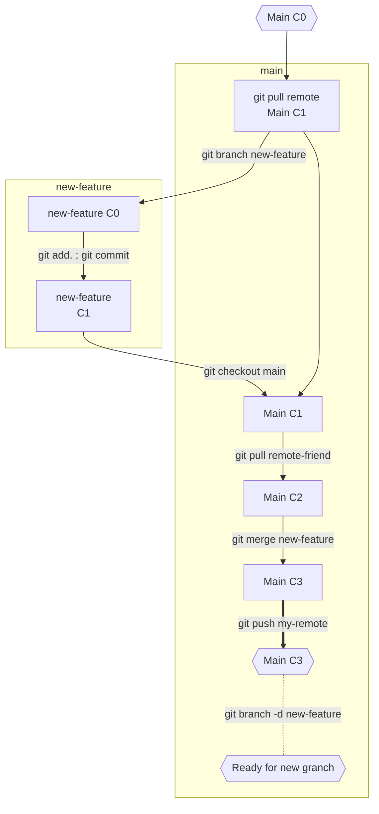

# minishell

## Gestion de Git

> [!IMPORTANT]
> Version sans conflit

1. git Pull remote-friend main
2. git branch new-feature
3. (new-feature) git add . ; git commit
4. git checkout main
5. git pull remote-friend
6. git merge new-feature
7. git push my-remote main
8. git branch -d new-feature
   

